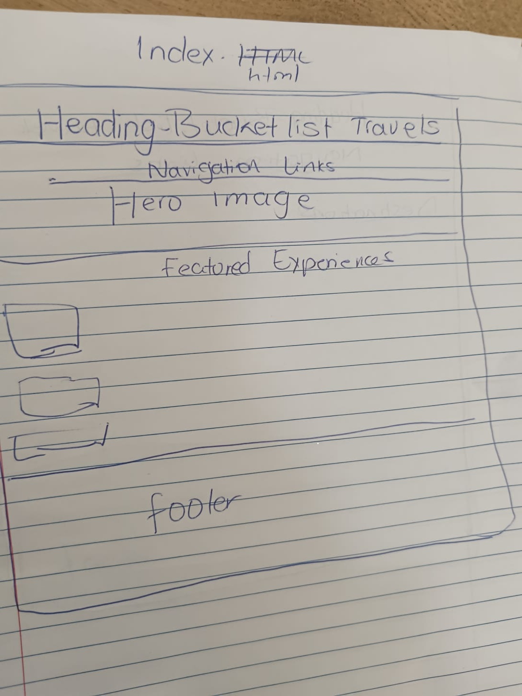
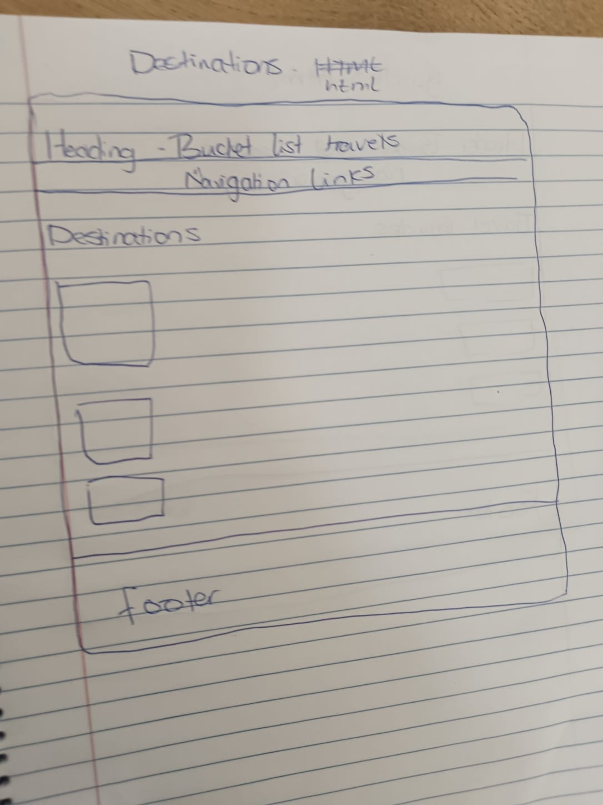
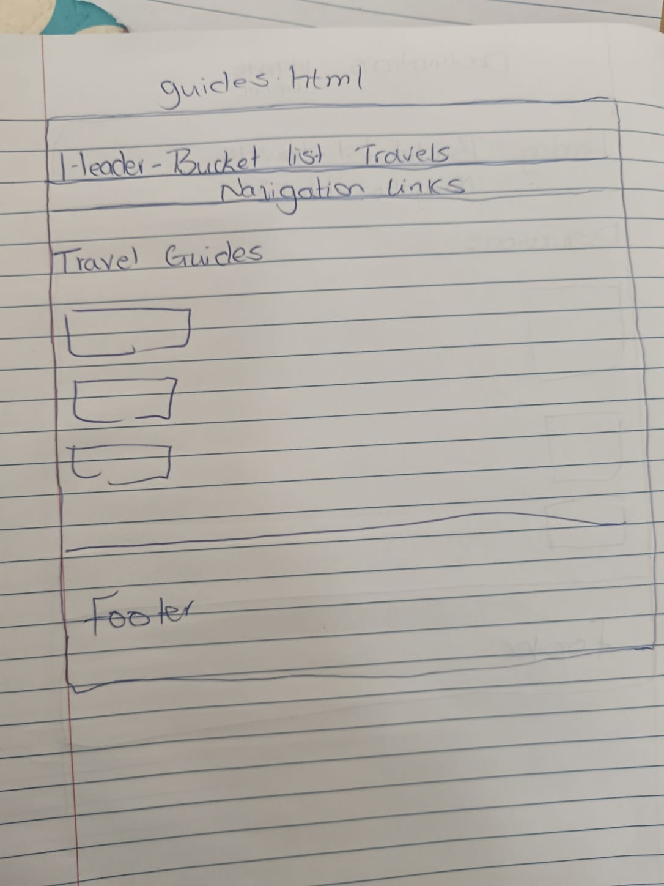
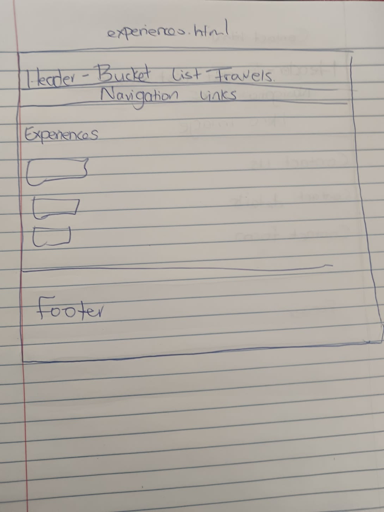
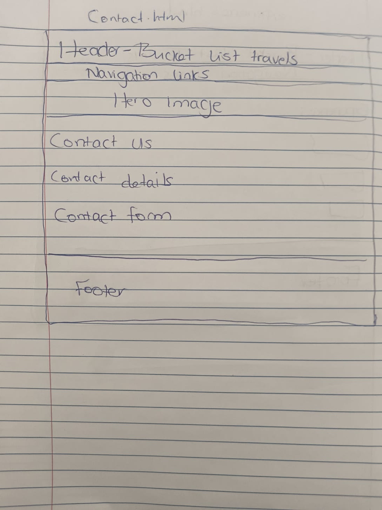
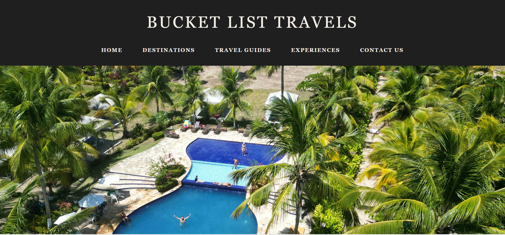
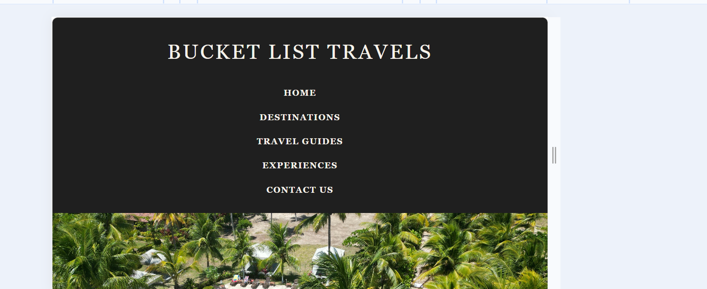
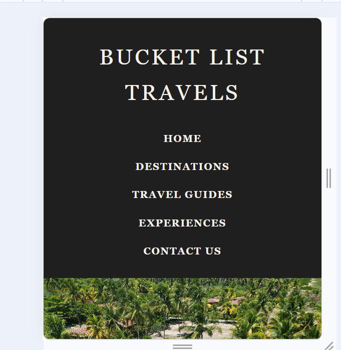
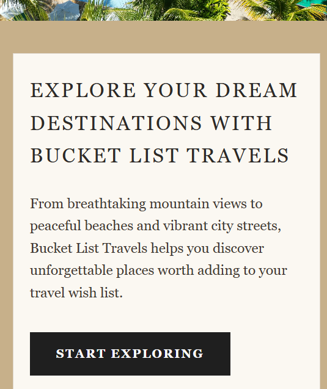
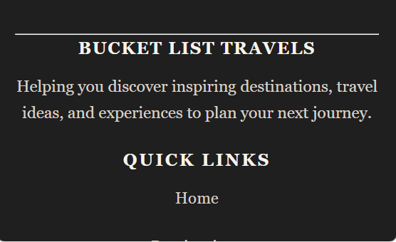

# Bucket List Travels Website

## Student Information

Name: Dineo Lesabe
Course: Web Development (Introduction) WEDE5020
Project: Website Development Assignment

---

## Project Overview

Bucket List Travels is a travel-focused website designed to inspire users to explore destinations around the world. The platform provides curated travel ideas, destination insights, and travel experiences to help users discover and plan future trips.

The website is designed for travel enthusiasts who are looking for inspiration and guidance when planning trips.

The website is built using HTML and follows semantic structure principles, including the use of header, main, section, and footer elements to organise content in a clear and structured way.

This website focuses on content-driven travel inspiration rather than direct booking services.

The website is designed to be easy to navigate, allowing users to find and explore content without difficulty.

---

## Website Goals and Objectives

- Attract at least 500 unique visitors to the website within the initial launch period
- Achieve an average of at least 3 pages per session to indicate user engagement
- Ensure users can navigate between key pages within 2–3 clicks
- Provide at least 5 detailed destination or experience entries across the website

## Key Features and Functionality

- Homepage with introduction and featured content
- Destinations page showcasing popular travel locations with images and brief descriptions
- Travel Guides page with general tips and recommendations
- Experiences page highlighting different types of travel activities
- Contact page for user enquiries
- Consistent header, navigation menu, and footer across all pages
- Internal links connecting pages for improved user navigation

---

## Timeline and Milestones

- Project planning and content research completed
- Website structure and HTML pages created
- Navigation implemented and tested across all pages
- Images added and standardised using local file paths
- Content refined for clarity and consistency
- CSS styling to be implemented in the next phase
- Final testing and submission pending

---

## Website Structure (Sitemap)

- Home (index.html)
  - Destinations (destinations.html)
  - Travel Guides (guides.html)
  - Experiences (experiences.html)
  - Contact (contact.html)

Future improvements may include additional pages with more detailed destination and travel content.

---

## Wireframes

The following low-fidelity wireframes were added based on the feedback received for Part 1. The wireframes show the planned layout of the main website pages before final styling was applied.

### Home Page Wireframe

The home page wireframe shows the planned structure for the header, navigation menu, hero image, introduction content, featured experiences and footer.

### Destinations Page Wireframe

The destinations page wireframe shows how destination content is arranged using page headings, destination sections, images, descriptions and navigation links.

### Travel Guides Page Wireframe

The travel guides page wireframe shows the layout for travel advice, guide sections and supporting content to help users plan their trips.

### Experiences Page Wireframe

The experiences page wireframe shows the layout for different travel experience categories, including adventure, relaxation, cultural, luxury and family-friendly experiences.

### Contact Page Wireframe

The contact page wireframe shows the planned layout for contact details, enquiry information and the website footer.

## Part 1 Details

This project includes the foundational planning and development of the website, focusing on understanding the target organisation, researching relevant content, and designing a clear and user-friendly structure.

- Identification of the target organisation
- Content research and sourcing to determine relevant website content
- Website planning and structure development, including sitemap and layout

---

## Changelog

Part 1 updates

- Created project structure
- Added index.html (homepage)
- Added destinations.html
- Added guides.html
- Added experiences.html
- Added contact.html
- Implemented navigation across all pages
- Tested navigation and fixed broken links
- Added structured content for all pages
- Replaced generic tips with realistic, planning-focused content
- Added images to improve visual appeal
- Fixed broken image links
- Standardised all images to local file paths
- Added consistent footer across all pages
- Improved internal linking between pages

Part 2 Updates

- Used Flexbox to align and space the navigation links
- Styled the hero image as a full-width banner
- Styled images with controlled sizing and object-fit
- Improved spacing and layout across page sections
- Improved article sections for destinations, guides and experiences
- Added visual styling such as background colours, borders and hover effects
- Styled buttons and links with hover effects
- Improved footer styling across all pages
- Added responsive styling for smaller screens
- Adjusted mobile styling for the header, navigation, hero image, sections, images and footer
- Adjusted page structure to make styling more consistent
- Removed unnecessary horizontal lines for a cleaner layout
- Tested the website using browser developer tools
- Tested the desktop layout at 1366px width
- Tested the tablet layout at 768px width
- Tested the mobile layout at 375px width
- Checked the header, navigation, hero image, sections, images and footer across different screen sizes
- Added responsive design screenshots to the README
- Added missing wireframes based on Part 1 feedback
- Added wireframe images to the README to show the planned page layouts

---

## Image Sources

All images used in this project were sourced from royalty-free platforms such as Unsplash and are used for educational purposes.

---

## Responsive Design Testing

The website was tested using browser developer tools to check how the layout responds across different screen sizes. The testing focused on the header, navigation menu, hero image, content sections, images and footer.

### Desktop View

The desktop layout was tested at a width of 1366px. At this screen size, the navigation menu displays horizontally, the header remains centred, and the page content is presented in wide sections. The images also stay within their containers without breaking the layout.

### Tablet View

The tablet layout was tested at a width of 768px using browser developer tools. At this screen size, the layout remains readable and the content adjusts to fit a medium-sized screen. The navigation, page sections and images remain clear without causing horizontal scrolling.

### Mobile Top View

The mobile layout was tested at a width of 375px using browser developer tools. At this screen size, the navigation menu stacks vertically, the website title remains readable, and the hero image still displays below the header.

### Mobile Content View

The content sections were also tested on mobile to check that the text, images and spacing remain readable on a narrow screen. The sections adjust to the screen width and the images resize within the page layout.

### Mobile Footer View

The footer was tested separately on mobile because the full page cannot fit into one narrow screenshot. The footer links, social media labels, contact details and copyright information remain readable and organised.

### Testing Summary

The responsive testing showed that the website layout adjusts across desktop, tablet and mobile screen sizes. The CSS media query helps change the navigation, hero image, section spacing, image sizing and footer layout for smaller screens. The mobile layout was captured in separate screenshots because the narrow screen cannot show the header, content sections and footer in one view.

## Notes

This website was developed for educational purposes and demonstrates the use of HTML to create a structured multi-page website with clear navigation and organised content.

## References

Tripadvisor. (2026). Available at: https://www.tripadvisor.com (Accessed: 11 April 2026).

Airbnb. (2026). Available at: https://www.airbnb.com (Accessed: 11 April 2026).

Nielsen Norman Group. (2020). Available at: https://www.nngroup.com (Accessed: 11 April 2026).

The Lux Travel Co. (2026). Available at: https://theluxtravelco.co.za/ (Accessed: 11 April 2026).
